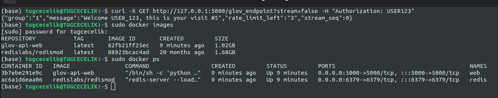

# glov-api

## Test:
From the terminal, go to the directory where the project is located and run the `docker-compose up` command.

Open a new terminal and run the following curl commands, for testing api.

`curl -X GET http://127.0.0.1:5000/glov_endpoint?stream=false -H "Authorization: USER123"`

`curl -X GET http://127.0.0.1:5000/glov_endpoint?stream=true -H "Authorization: USER123"`

`curl -X GET http://127.0.0.1:5000/glov_endpoint?stream=false -H "Authorization: USER1234"`

When we check Docker, we see that 2 containers are running.

Thank you!